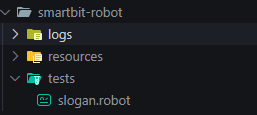
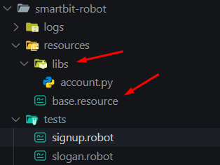

# Curso QAxperience

Para executar o ambiente de desenvolvimento, assegure que tenha executado o banco de dados postgres usando o docker, e depois de realizar o `npm install` tanto no diretório de API quanto no de WEB, execute o comando `npm run dev` para executar ambos.

Para popular o banco de dados, execute o arquivo [setup.sh](http://setup.sh) que está dentro do diretório da API, mas é necessário executá-lo em algum terminal linux

O ambiente será executado no endereço `localhost:3000` 

**Após rodando tudo corretamente, instale o Robot Framework em um ambiente virtual utilizando o comando**

`pip install robotframework`

Para conferir se o robot está funcionando corretamente além da instalação ter sido feita como esperado, crie um arquivo por exemplo “hello.robot” com as informações abaixo e execute `robot .\hello.robot` no terminal

```python
*** Settings ***
Documentation    Hello Robot

*** Test Cases ***
Deve mostrar mensagem de boas vindas
    Log    Hello Robot Framework    
```

Agora que validou a funcionalidade, faça a instalação da biblioteca browser do Playwrigth 

`pip install robotframework-browser`

E execute o Playwright para ser executado em ambiente Python usando o comando `rfbrowser init` no terminal

O código inicial deve ser parecido com este

```python
*** Settings ***
Documentation    Teste para verificar o Slogan no webapp
Library    Browser

*** Test Cases ***
Deve exibir o Slogan na Landing Page
    New Browser    browser=chromium    headless=False
    New Page    http://localhost:3000
    Get Text    css=.headline h2    equal    Sua Jornada Fitness Começa aqui!

    Sleep    5
```

A estrutura ideal para executar os testes em robot é a seguinte



O diretório principal, com a pasta resources e tests, e a pasta logs sendo gerada via parâmetro ao executar o script do robot `robot -d ./logs .\tests\slogan.robot`

### Faker para geração de massa de teste (utilizando a lib existente)

`pip install robotframework-faker`

Após instalado, implemente no código da seguinte forma (´é necessário informar o locale para dados específicos do brasil)

```python
*** Settings ***
Documentation    Cenário de testes de pré-cadastro de clientes
Library    Browser
Library    FakerLibrary    locale=pt_BR

*** Test Cases ***
Deve iniciar o cadastro do cliente
    ${name}=     FakerLibrary.Name
    ${email}=     FakerLibrary.Email
    ${cpf}=     FakerLibrary.cpf

    Fill Text    id=name        ${name}
    Fill Text    id=email       ${email}
    Fill Text    id=document    ${cpf}

```

### Criando um arquivo resource e lib própria

utilize o comando `pip install faker` para instalar a biblioteca faker para o python para a criação da função

Para criar um arquivo “pai” onde as automações irão se centralizar, vá na pasta resources e crie um arquivo chamado “base.resources”, além de criar dentro da pasta resources, uma pasta chamada “libs” com um arquivo chamado account



No arquivo “signup.robot” , importe a base resource utilizando a seguinte instrução no código `*Resource*    ../resources/base.resource`

No arquivo base.resource, importe a library própria que foi criada 

```python
*** Settings ***
Documentation    Arquivo principal do projeto robot
Library    libs/account.py
```

E no arquivo [account.py](http://account.py) crie a função que irá gerar os accounts

```python
from faker import Faker
fake = Faker('pt_BR')

def get_fake_account():
    account = {
        'name': fake.name(),
        'email': fake.email(),
        'cpf': fake.ssn() #gerar cpf sem pontuação, com pontuação é "cpf"
    }
    return account
```

Para chamar a keyword (função) criada no account.py, apenas digite “Get Fake Account” no “signup.robot” e estará podendo utilizar dos recursos, na prática o código ficará similar a isso:

```python
    ${account}    Get Fake Account

    Fill Text    id=name        ${account}[name]
    Fill Text    id=email       ${account}[email]
    Fill Text    id=document    ${account}[cpf]
```